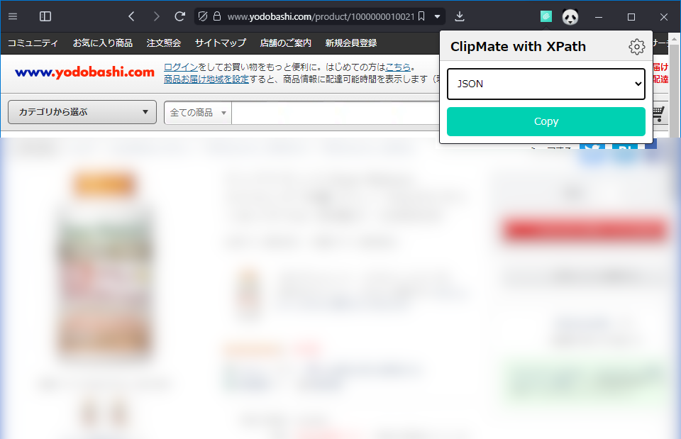

# ClipMate with XPath
任意のウェブサイトにおいて，XPath で指定した要素のテキストを指定した形式でクリップボードにコピーする Chrome 拡張機能です。

## インストール
[](https://chromewebstore.google.com/detail/clipmate-with-xpath/ejelddbcnafpclfkbpaegddgklpaahki?)

## 使い方
### サイトの設定を行う
1. 設定ページを開き，ウェブサイトの追加ボタンを押します。
2. 対象の URL を入力します。
3. 要素を追加ボタンを押します。
4. 抽出したい情報の名前（＝要素名）と，その XPath を入力します。
5. 終わったら，設定を保存します。


### サイトの情報をコピーする
1. 対象のウェブサイトに進み，拡張機能のアイコンをクリックします。
2. 形式を選択し，Copy ボタンを押します。
3. コピーされたことが通知されます。
4. クリップボードに情報がコピーされています。
5. 試しに，メモ帳に貼り付けてみてください！



## カスタムスタイルの設定
クリップボードにコピーされる際の形式を指定することができます。

例えば，サイトの設定で商品名と金額の XPath を設定し，
新しいカスタムスタイルとして以下を定義します。
```
{商品名}，{金額}
```
新しいカスタムスタイルを選択して，コピーボタンを押すと以下のような情報がコピーされます！

```
ディアナチュラ Dear-Naturaストロング 39種 アミノ マルチビタミン＆ミネラル 300粒入（100日分），￥2,220
```
スタイルの表記には3種類のメタ文字（改行`\n` ，タブ文字`\t`，空白`\s`）が使用できます。

## 設定のインポートとエクスポート
設定はjsonファイルでインポートとエクスポートができます。


## License
[GNU一般公衆ライセンス v3\.0 \- GNUプロジェクト \- フリーソフトウェアファウンデーション](https://www.gnu.org/licenses/gpl-3.0.html)
